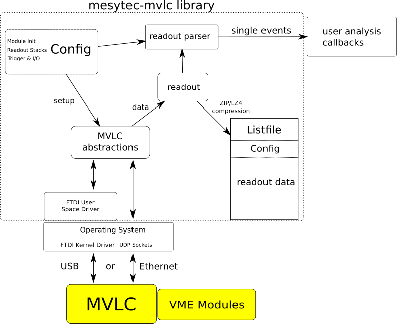

mesytec-mvlc  {#mainpage}
=========================

*User space driver library for the Mesytec MVLC VME controller.*

*mesytec-mvlc* is a driver and utility library for the [Mesytec MVLC VME
controller](https://mesytec.com/products/nuclear-physics/MVLC.html) written in
C++. The library consists of low-level code for accessing MVLCs over USB or
Ethernet and higher-level communication logic for reading and writing internal
MVLC registers and accessing VME modules. Additionally the basic blocks needed
to build high-performance MVLC based DAQ readout systems are provided:

* Configuration holding the setup and readout information for a single VME
  crate containing multiple VME modules.

* Multithreaded readout worker and listfile writer using fast data compression
  (LZ4 or ZIP deflate).

* Readout parser which is able to handle potential ethernet packet loss.

* Live access to readout data on a best effort basis. Sniffing at the data
  stream does not block or slow down the readout.

* Examples showing how to combine the above parts into a working readout system
  and how to replay data from a previously recorded listfile.

* Various counters for monitoring the system.

* Can use configs exported from [mvme](https://mesytec.com/downloads/mvme.html).

Components
----------

* MVLC USB and Ethernet/UDP implementations
  - Two pipes (mapped to USB endpoints or UDP ports)
  - Buffered reads for direct communication
  - Unbuffered/low level reads for high-performance readouts
  - Counters

* Dialog layer - internal and VME register read/write access
  - UDP retries to mitigate packet loss

* Stack error notification polling
* Standard Listfile format plus writer and reader code
* Core readout loop and multithreaded readout worker
* Thread-safe readout buffer queues. Allows to sniff and analyze data in a
  separate thread during a DAQ run.
* Init/readout stack building
* Stack memory management and uploading
* Readout/Response Parser using information from the readout stacks to parse
  incoming data.

* Single VME Crate readout config:
  - List of stack triggers: required to setup the MVLC
  - List of readout stacks: required for the MVLC setup and for parsing the data stream
  - VME module init sequence
  - MVLC Trigger I/O init sequence

* Single VME Crate readout instance:
  - readout config
  - readout buffer structure with crateId, number, type, capacity, used and
    view/read/write access
  - readout buffer queue plus operations (blocking, non-blocking)
  - listfile output (the readout config is serialized into the listfile at the start)

* Listfile Writer
  - Takes copies of readout buffers and internally queues them up for writing
  - Fast LZ4 and slower ZIP (deflate) compressions are supported.

* Listfile reader
  - Transparently handles LZ4 and ZIP compressions
  - Loads the CrateConfig from the listfile
  - Reads data buffers, checks internal framing, passes buffers to thread-safe queue.

* Stack batch execution
  - Used to execute large command lists by splitting them into max sized stack
    chunks and running those. Max size means that the command stack does not
    overflow.

Limitations
-----------
* There are currently no library abstractions for the MVLC Trigger/IO module.

  The module can still be configured by manually writing the correct MVLC
  registers. When using a CrateConfig generated by
  [mvme](https://mesytec.com/downloads/mvme.html) the Trigger/IO setup is
  included and will be applied during the DAQ init procedure.

  Once the Trigger/IO Module has matured and is feature complete an appropriate
  software abstraction will be added.

* Multicrate readouts are not yet supported. In theory multiple MVLCs can be
  read out from a single process but there is no time synchronization between
  crates. Multicrate support will be added with future firmware and library revisions.

Installation
------------
The library works on Linux and Windows. The only external dependency is zlib,
all other dependencies are included in the source tree.

Windows builds currently only work in an [MSYS2](https://www.msys2.org/)
enviroment. Add ``-G"MSYS Makefiles"`` to the cmake command line to generate a
working build system.

    git clone https://github.com/flueke/mesytec-mvlc
    mkdir mesytec-mvlc/build
    cd mesytec-mvlc/build
    cmake -DCMAKE_BUILD_TYPE=Release ..
    make

TODO
----
* abstraction for the trigger/io system. This needs to be flexible because the
  system is going to change with future firmware udpates.
* mini-daq/readout worker: add ability to resume a running readout. This means
  triggers will not be disabled on connect and no init sequence will be run.
  Instead we go directly to reading from both pipes (data and notifications).

* examples
  - Minimal CrateConfig creation and writing it to file
  - Complete manual readout including CrateConfig setup for an MDPP-16

* Multicrate support.
  - Additional information needed and where to store it.
  - multi-crate-mini-daq
  - multi-crate-mini-daq-replay

* Directly include the fmt::fmt-header-only library in the source tree and
  manually install the required headers into a subdirectory of
  mesytec-mvlc/include.
  This would solve the issue I'm having with the example project where
  find_package(mesytec-mvlc) cannot resolve the fmt dependency without a
  workaround of manually doing a find_package(fmt) first.

* Add 'overwrite' flag to ZipCreator and default to not overwriting exiting
  files.
